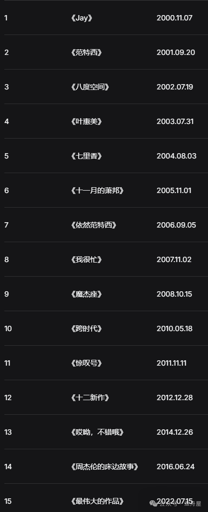

在那个遥远的午后，我不知道转到了哪个遥远的学校，班里有个酷 Boy，有那么点周杰伦的味道，如今也变得遥远了。从此周杰伦就慢慢进入了我的世界，而如今那个朋友也断了联系，大概现在应该跟我一样酷吧。

## 古典钢琴手 JAY，R&B 与嘻哈

陶喆经把 R&B 带到华语乐坛，我个人观点周杰伦的 R&B 不一样，他 R 的比陶喆更让人有情绪，可能是因为随意（谁知道陶喆现在 R 的更随意）。

另外最成就周杰伦我感觉是他音乐的文字叙事，混合 R&B 与嘻哈等都恰到好处，许嵩的《玫瑰花的葬礼》就是这种叙事，又暴露年龄，老非主流了。就比如《半岛铁盒》里那句"小姐，请问有没有卖半岛铁盒"的开门声就像是电影镜头开场。他给画面配乐，还是他给音乐配画面。而最妙的是，他把这种叙事嵌进了 R&B 和嘻哈里，也把 R&B 和嘻哈嵌到叙事里，嵌得恰到好处。还有《以父之名》的开场白，意大利语念完直接进说唱，然后转成旋律，再回到说唱……一首歌演完一部黑帮电影。这种结构，华语乐坛少有人做。我认为对他营养最大的还是古典音乐，他的歌往往有前奏、间奏、尾奏，甚至有转调，相对其他流行歌曲更复杂，这来自古典音乐作品复杂的结构。这种古典底色，让他的音乐作品厚度，说俗一点就是在华语乐坛中耐听。

这是所有歌曲迅雷网盘链接：

> 分享文件：周杰伦
> 链接：`https://pan.xun（去除）lei.com/s/VOmyrRlrVoC_UJcntaa6AW-OA1?pwd=87yq#`

